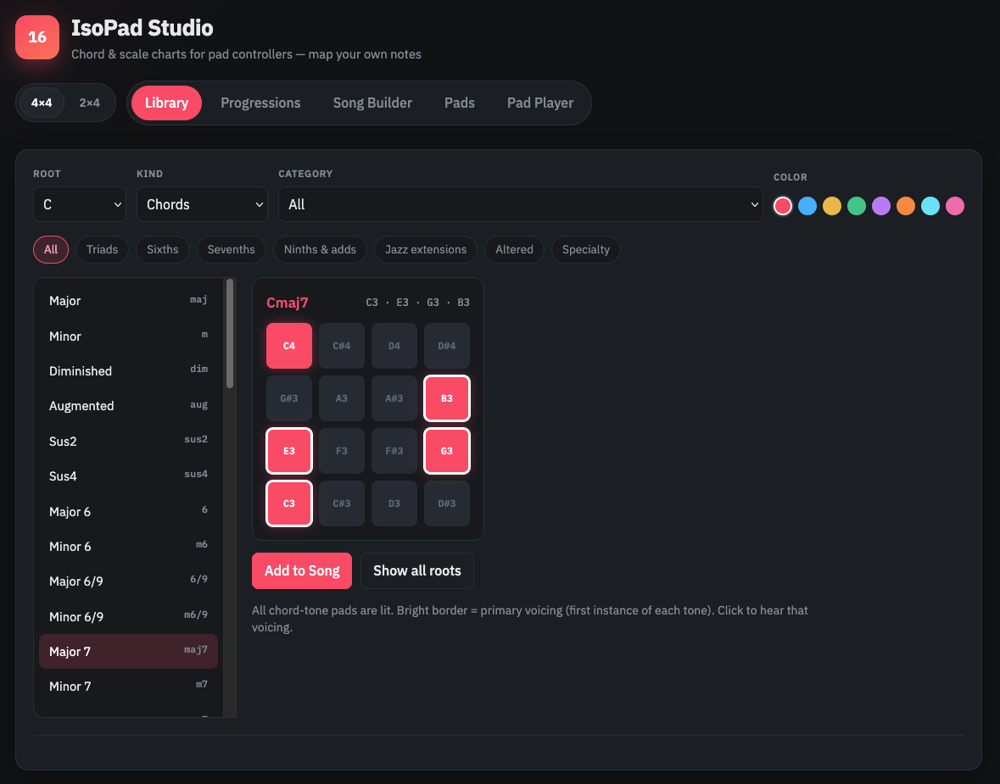
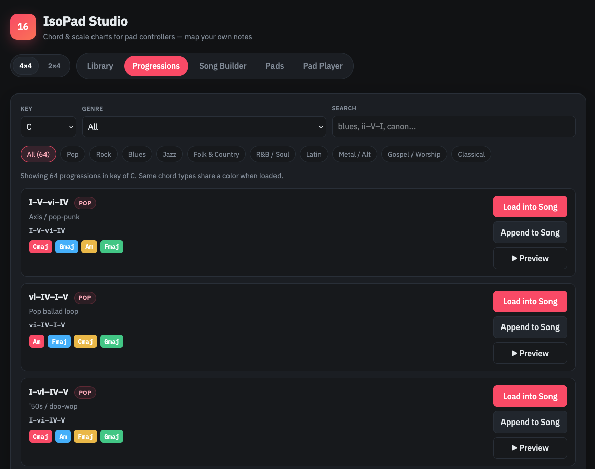
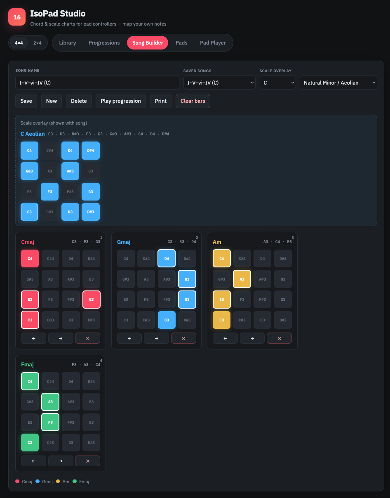
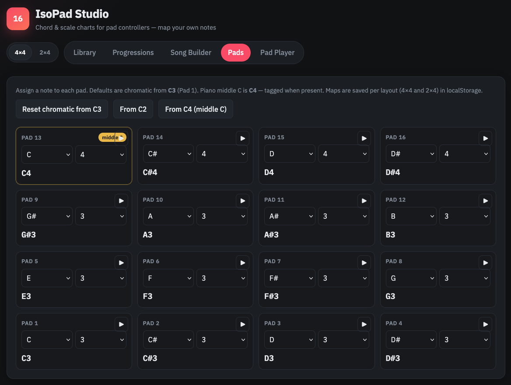
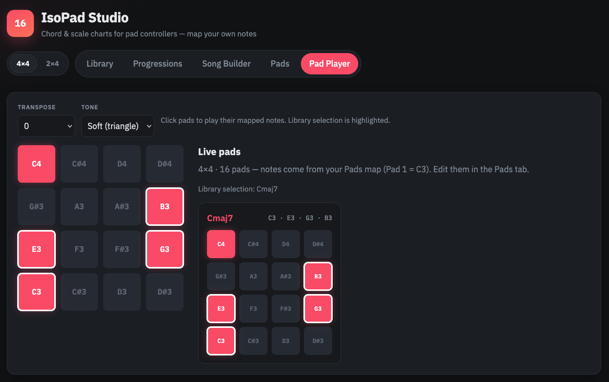
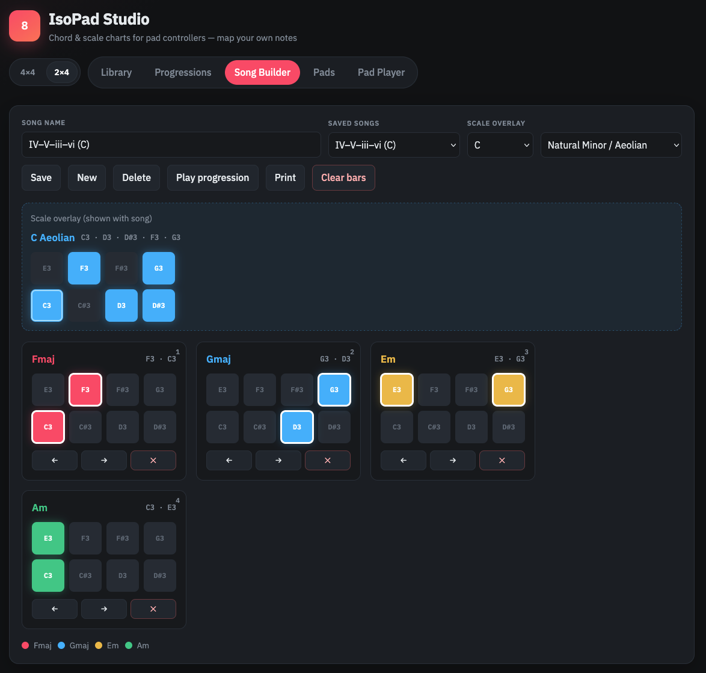

# IsoPad Studio

Isomorphic pad charts for controllers — **iso** (same shapes in every key) + **pad** + **studio** (chords, scales, songs, and your own note map).

> Learn one chord shape. Play it in every key. Charts, scales, and songs for MPD / LPD / MPC-style pads.

Chord and scale charts for **pad controllers**. Map each pad to any note, then browse chords, scales, and progressions that light the right pads automatically.

Supports two layouts:

| Layout | Pads | Controllers |
|---|---|---|
| **4×4** | 16 | Akai MPD218, MPC pads, and similar |
| **2×4** | 8 | Akai LPD8, Korg nanoPAD, and similar |

Toggle the layout anytime. Each layout has its own saved pad note map.

## Screenshots

### Chord library — see the shape, hear the voicing



Pick any root and chord type (here **Cmaj7**). Every chord-tone pad lights up; a **bright border** marks the primary voicing (C3 · E3 · G3 · B3). The octave C4 stays lit so you still see it on the board — without stealing focus from the shape you’ll actually play. Click the chart to hear it; hit **Add to Song** when it’s a keeper.

### Progressions — 60+ stock forms by genre



Browse **64** progressions in any key — Pop, Blues, Jazz, Rock, Gospel, and more. Color chips preview the chord string at a glance (same chord type → same color when loaded). **Load**, **Append**, or **Preview** without leaving the page. Perfect for dropping a 12-bar blues or I–V–vi–IV into the Song Builder in one click.

### Song Builder — color-coded bars + scale overlay



Build a full progression as a strip of pad charts. Here the classic **I–V–vi–IV** in C shows four colors so repeated chords stay obvious (great for blues and pop loops). Overlay a scale (e.g. **C Aeolian**) above the song to practice leads on the same board. Reorder bars, play the progression, or **Print** a clean setlist.

### Pads — map every note to your hardware



No more assuming Pad 1 is C. Assign **note + octave** to each pad, audition with ▶, and reset to chromatic from **C3**, **C2**, or **C4**. Piano **middle C (C4)** is tagged when it appears. Maps save per layout in `localStorage` — change the map once, and every chord, scale, and song updates automatically.

### Pad Player — jam the live grid



Click pads to play their mapped notes in the browser. Your Library selection (here **Cmaj7**) stays highlighted on the big grid with the same primary-border logic, so practice matches the chart. Transpose and tone controls are right there for quick auditioning.

### 2×4 mode — LPD8 / nanoPAD ready



Flip the header to **2×4** and the whole app shrinks to eight pads — same songs, same colors, same overlays, recomputed for the smaller board. Ideal for Akai LPD8, Korg nanoPAD, and anything with two rows of four.

## Features

- **Pads editor** — assign note + octave to every pad (defaults: chromatic from **C3**; piano middle C is **C4**)
- **Chord library** — triads through jazz extensions; all chord tones lit, primary voicing bordered
- **Scales & modes** — lights every in-scale pad on your board
- **Progressions** — 60+ stock progressions grouped by genre
- **Song Builder** — color-coded bars, scale overlay, `localStorage`, print
- **Pad Player** — click pads to hear mapped notes; optional transpose
- **4×4 and 2×4 layouts** — switch anytime; each keeps its own pad map

## Requirements

A modern desktop browser (Chrome, Firefox, Safari, or Edge) and a **local web server**.

> **Do not open `index.html` directly as a `file://` URL.**  
> Some browsers restrict audio, fonts, or storage when pages are loaded from disk. Always serve the folder over HTTP.

## Quick start

```bash
cd isopadstudio
python3 -m http.server 8000
```

Open [http://localhost:8000](http://localhost:8000). Stop with `Ctrl+C`.

## Run on each platform

### macOS

```bash
cd /path/to/isopadstudio
python3 -m http.server 8000
```

Visit [http://localhost:8000](http://localhost:8000). Install Python from [python.org](https://www.python.org/downloads/) or `brew install python` if needed.

### Windows

```powershell
cd path\to\isopadstudio
python -m http.server 8000
```

If that fails, try `py -m http.server 8000`. Visit [http://localhost:8000](http://localhost:8000).

### Linux

```bash
cd /path/to/isopadstudio
python3 -m http.server 8000
```

### Other servers

```bash
npx --yes serve -l 8000
php -S localhost:8000
ruby -run -ehttpd . -p8000
```

Or host the folder on Apache, nginx, GitHub Pages, Netlify, etc. — no backend or build step.

## How to use

### Layout toggle

Use **4×4** / **2×4** in the header. The badge shows `16` or `8`.

### Pads (important)

Open the **Pads** tab and set what each pad plays:

- Default: chromatic half-steps starting at **C3** on Pad 1 (same idea as a typical MPD chromatic map)
- **Middle C** on a piano is **C4** — when a pad is C4 it shows a “middle C” tag
- Presets: reset chromatic from **C3**, **C2**, or **C4**
- Click ▶ on a pad to audition
- Maps are stored **per layout** in `localStorage`

After you change the map, every chord, scale, progression, and song chart updates to match.

### Library

1. Choose root, Chords or Scales, and a formula.
2. Click the chart to hear it.
3. **Add to Song** with a color; **Show all roots** for every key.

### Progressions

Pick a key, filter by genre, **Preview**, then **Load** or **Append** into the Song Builder.

### Song Builder

Reorder bars, overlay a scale, save songs, print a setlist.

### Pad Player

Play the live grid using your mapped notes. Optional transpose for auditioning.

## Project layout

```
isopadstudio/
├── index.html
├── app.css
├── app.js
├── lib/music.js      # Shared pad/chord math (tested)
├── progressions.js
├── screenshots/      # README gallery
├── test/             # node:test suite (`npm test`)
├── README.md
├── LICENSE
└── CONTRIBUTING.md
```

## Development

```bash
npm test          # unit + smoke tests (required before release)
npm run release   # tests, then semantic-release (CI does this on main)
```

## Default map reminder

With the factory chromatic-from-C3 map on **4×4**:

```
C4 C#4 D4 D#4     ← top
E3 F3  F#3 G3
G#3 A3 A#3 B3
C3 C#3 D3  D#3    ← Pad 1 = C3 (bottom-left)
```

**2×4** is the bottom two rows of that idea (C3–G3 by default).

You can replace any of those assignments in the Pads tab — they do not have to be chromatic or contiguous.

## Privacy

Songs, layout choice, and pad maps stay in your browser (`localStorage`). Nothing is uploaded.

## License

MIT — see [LICENSE](LICENSE).

## Releases

Pushes to `main` run [semantic-release](https://github.com/semantic-release/semantic-release) via GitHub Actions. Use [Conventional Commits](https://www.conventionalcommits.org/):

| Commit prefix | Release |
|---|---|
| `fix:` | patch |
| `feat:` | minor |
| `feat!:` / `BREAKING CHANGE:` | major |

## Contributing

See [CONTRIBUTING.md](CONTRIBUTING.md).
